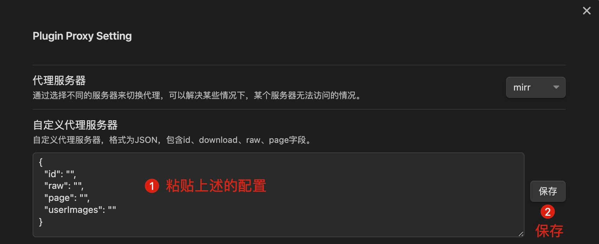

# Obsidian Proxy Server

为了解决国内无法访问插件商店和主题商店的问题，我写了这个代理服务器，可以部署在netlify上运行。

## 部署

部署方法，请登录netlify，点击New site from Git，选择GitHub，然后选择你的仓库，点击Deploy site，稍等片刻，就可以访问你的网站了。

## 使用

需要结合Obsidian Proxy Github插件使用，插件地址：

<https://github.com/gslnzfq/obsidian-plugin-proxy>

该插件是基于别人的插件修改而来，原插件地址：

<https://github.com/binyu1231/obsidian-plugin-proxy>

## 配置

